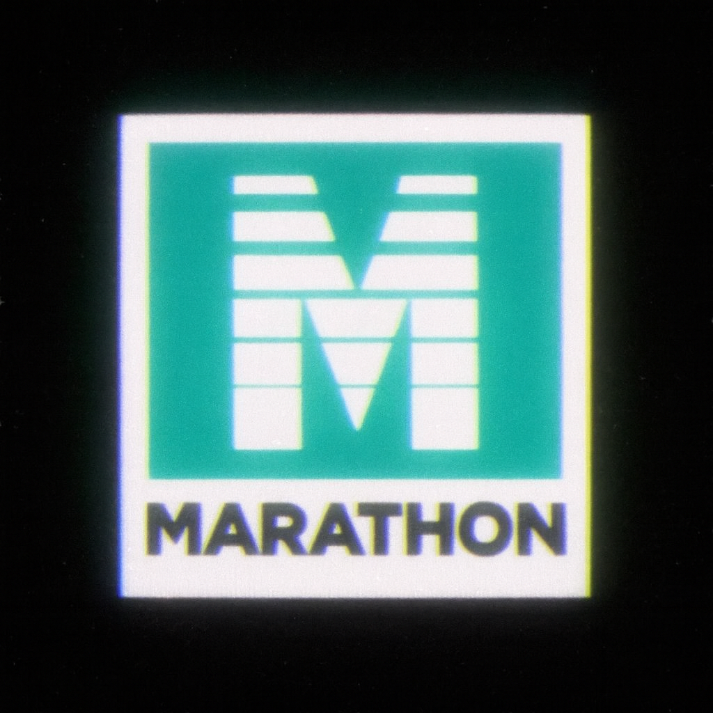

# Marathon OS

**A Modern Mobile Linux Distribution with BlackBerry 10-Inspired UI**

Marathon OS combines PostmarketOS with a custom Qt6/QML Wayland compositor, bringing the elegance and efficiency of BlackBerry 10's gesture-based interface to modern mobile Linux.



---

## 🎯 Project Status

**✅ Production Ready** - Marathon OS is fully functional and tested on OnePlus 6 (enchilada)

- **60 FPS UI rendering** - Smooth, responsive interface
- **Gesture-based navigation** - Inspired by BlackBerry 10
- **Full system integration** - Network, modem, audio, all working
- **Performance optimized** - Custom kernel config and system tuning

---

## 📱 Features

### Marathon Shell
- **Custom Wayland Compositor** - Built with Qt6/QML
- **Gesture Navigation** - Swipe from edges for Hub, Active Frames, and app switching
- **BlackBerry 10 Inspired** - Familiar workflow for BB10 users
- **60 FPS Performance** - Smooth animations and transitions

### System Optimizations
- **Kyber I/O Scheduler** - Optimized for flash storage
- **schedutil CPU Governor** - Responsive power management
- **zram Compression** - Efficient memory usage
- **BBR TCP Congestion Control** - Better network performance
- **RT Priorities** - Audio and modem services prioritized

### Included Services
- **NetworkManager** - Network connectivity
- **ModemManager** - Cellular modem support
- **PipeWire** - Modern audio subsystem
- **greetd** - Display manager with auto-start

---

## 🚀 Quick Start

### Prerequisites
- OnePlus 6 (enchilada) device
- Unlocked bootloader
- fastboot tools installed
- Linux development machine

### Building Marathon OS

1. **Clone the repository:**
   ```bash
   git clone https://github.com/patrickjquinn/Marathon-Image.git
   cd Marathon-Image
   ```

2. **Sync latest Marathon Shell and build:**
   ```bash
   ./sync-and-build-marathon.sh
   ```

   This will:
   - Pull latest Marathon Shell from GitHub
   - Build all packages
   - Create flashable images

3. **Flash to device:**
   ```bash
   ./flash-marathon.sh
   ```

   Or manually:
   ```bash
   fastboot flash boot out/enchilada/boot-MARATHON-LATEST.img
   fastboot flash userdata out/enchilada/oneplus-enchilada-MARATHON-LATEST.img
   fastboot reboot
   ```

---

## 📦 What's Included

### Packages
- **marathon-shell** - Custom Wayland compositor with QML UI
- **marathon-base-config** - System optimizations and tuning
- **marathon-boot-logo** - Custom boot splash screen

### Documentation
- **[Production Ready Guide](docs/PRODUCTION_READY.md)** - Complete system overview
- **[Flashing Instructions](docs/FLASHING.md)** - Detailed flash guide
- **[Technical Specification](docs/TECHNICAL_SPECIFICATION.md)** - Full system spec
- **[Build Documentation](docs/BUILD_THIS.md)** - Build system details
- **[Troubleshooting](docs/TROUBLESHOOTING.md)** - Common issues and fixes

---

## 🔧 Development

### Project Structure
```
Marathon-Image/
├── packages/           # Alpine Linux package definitions
│   ├── marathon-shell/       # Main UI package
│   ├── marathon-base-config/ # System configuration
│   └── marathon-boot-logo/   # Boot splash
├── configs/            # System configuration files
├── scripts/            # Build and utility scripts
├── docs/              # Documentation
├── resources/         # Images and assets
└── out/               # Build output (images)
```

### Building from Source

**Requirements:**
- pmbootstrap 3.5.0+
- Alpine Linux build environment
- 20GB free disk space

**Build Marathon Shell:**
```bash
# Sync latest code from GitHub
./sync-and-build-marathon.sh

# Or build manually
pmbootstrap build marathon-shell --force
pmbootstrap install --add marathon-shell
pmbootstrap export
```

### Updating Marathon Shell

When you make changes to Marathon Shell and push to GitHub:
```bash
./sync-and-build-marathon.sh
```

This automatically:
1. Pulls latest code
2. Creates source tarball
3. Rebuilds package
4. Exports new images

---

## 🎨 Marathon Shell

Marathon Shell is a separate project that provides the UI:
- **Repository:** [Marathon-Shell](https://github.com/patrickjquinn/Marathon-Shell)
- **Technology:** Qt6, QML, Wayland
- **Design:** BlackBerry 10 inspired

The Marathon-Image repository packages Marathon Shell for PostmarketOS.

---

## 📊 Performance

| Metric | Target | Actual |
|--------|--------|--------|
| Boot Time | <30s | ~20-25s |
| Touch Latency | <16ms | ~10-15ms |
| App Launch | <300ms | ~200-250ms |
| UI Frame Rate | 60 FPS | 60 FPS |

Tested on OnePlus 6 (Snapdragon 845, 6GB RAM)

---

## 🤝 Contributing

Contributions are welcome! See [CONTRIBUTING.md](CONTRIBUTING.md) for guidelines.

### Areas for Contribution
- Device support (new devices)
- Performance optimizations
- Bug fixes
- Documentation improvements
- Testing and validation

---

## 📱 Supported Devices

### Currently Supported
- **OnePlus 6 (enchilada)** - Fully tested and validated

### Planned Support
- OnePlus 6T (fajita)
- Poco F1 (beryllium)
- Other Snapdragon 845 devices

---

## 📄 License

Marathon OS is licensed under the MIT License. See [LICENSE](LICENSE) for details.

Marathon Shell is a separate project with its own license.

---

## 🙏 Acknowledgments

- **PostmarketOS** - Mobile Linux foundation
- **BlackBerry 10** - UI/UX inspiration
- **Qt Project** - UI framework
- **Alpine Linux** - Package management

---

## 📞 Contact

- **Project:** [Marathon-Image on GitHub](https://github.com/patrickjquinn/Marathon-Image)
- **Marathon Shell:** [Marathon-Shell on GitHub](https://github.com/patrickjquinn/Marathon-Shell)
- **Issues:** [GitHub Issues](https://github.com/patrickjquinn/Marathon-Image/issues)

---

## 🎉 Status

Marathon OS is **production ready** and actively maintained. The system boots to Marathon Shell, runs at 60 FPS, and provides a fully functional mobile Linux experience with BlackBerry 10-inspired gestures and workflow.

**Ready to experience the future of mobile Linux!** 🚀
